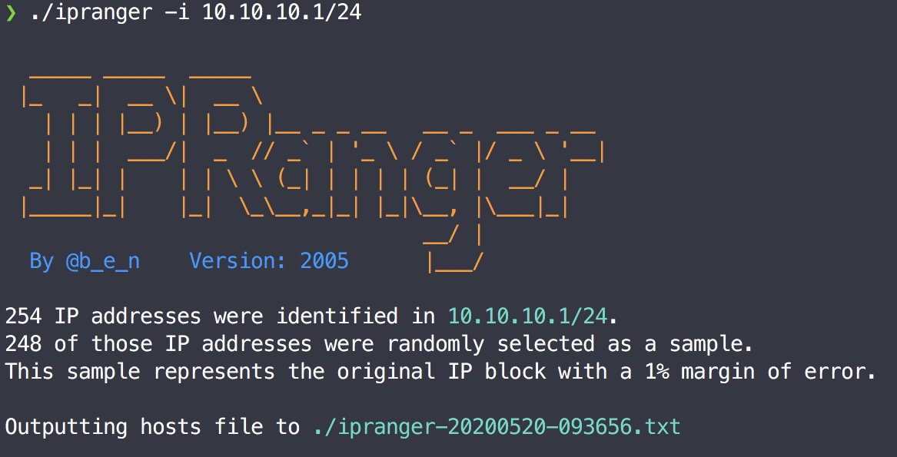

<h1 align="center">Welcome to IPRanger 🤠</h1>
<p>
  
  <a href="#" target="_blank">
    
  </a>
</p>



> IPRanger gives you a representative random sample hosts from a CIDR range.
> Intended to help when scanning every host is infeasible due to scope size.

## Requirements
* Python 3.6+
(The precompiled binary specifically requires Python 3.8)

## Installation
```sh
git clone https://github.com/bennettwarner/ipranger.git
cd ipranger
pip3 install -r requirements.txt
```
or run the precompiled binary available under releases

## Usage

```sh
python3 ./ipranger/ipranger.py -i 10.10.10.1/24 -o ./myhosts.txt
```

## Contributors

**Bennett Warner**

* Twitter: [@b_e_n](https://twitter.com/b_e_n)
* Github: [@bennettwarner](https://github.com/bennettwarner)

**Zach Lawson**

* Twitter: [@tnkr](https://twitter.com/_tnkr_)
* Github: [@tnkr](https://github.com/tnkr)


## Show your support

Give a ⭐️ if this project helped you!

***
_This README was generated with ❤️ by [readme-md-generator](https://github.com/kefranabg/readme-md-generator)_
